# Multi-Engine Database Access & Validation Platform

[](https://openjdk.org/projects/jdk/25/)
[](https://spring.io/projects/spring-boot)
[](https://testcontainers.com/)
[](LICENSE)

A multi-module Spring Boot repository built to explore, benchmark, and validate modern database paradigms using **Java 25**, **Spring Boot 4.1.1**, and **Testcontainers**.

Rather than basic single-entity CRUD examples, each database module models realistic **Capital Markets** scenarios—including high-throughput trade execution pipelines, real-time tick streaming, credit risk contagion graph traversal, sliding-window rate limiting, Paxos lightweight transactions, distributed serializability contention, Single-Table NoSQL design, columnar OHLCV aggregations, and HNSW vector similarity search.

---

## 🏛️ Architecture & Database Matrix

```mermaid
flowchart TD
    subgraph Client["Unified Domain (commons)"]
        Accounts["Accounts & Balances"]
        Orders["Orders & Execution Strategies"]
        Quotes["Market Ticks & Quotes"]
        Exposure["Counterparty Risk Exposure"]
        Research["Research Reports & Embeddings"]
    end

    subgraph Relational["OLTP & Distributed SQL"]
        PG["reactive-postgres\n(PostgreSQL 18 R2DBC)"]
        CR["cockroachdb\n(CockroachDB v23.2)"]
        ORA["oracle26ai\n(Oracle Cloud R2DBC)"]
        H2["h2 / reactive-h2\n(In-Memory SQL)"]
        SQLITE["sqlite3\n(Embedded SQL)"]
    end

    subgraph FastData["In-Memory & Wide-Column"]
        RD["redis\n(Redis 7.2 Alpine)"]
        CS["cassandra\n(Cassandra 4.1 CQL)"]
        RCS["reactive-cassandra\n(Cassandra 4.1 Reactive)"]
        IGN["apache-ignite\n(In-Memory Cache)"]
        HZ["hazelcast-server\n(In-Memory Data Grid)"]
    end

    subgraph DocumentGraphVector["Document, Graph & Vector"]
        MG["mongodb\n(MongoDB 7.0)"]
        NJ["neo4j\n(Neo4j 5.13 Graph)"]
        QD["qdrant\n(Qdrant v1.13 Vector DB)"]
    end

    subgraph CloudNoSQL["Cloud NoSQL & Object Storage"]
        DDB["dynamodb\n(DynamoDB Single-Table)"]
        S3["aws-s3\n(LocalStack S3)"]
    end

    subgraph StreamingCDC["Streaming & Event-Driven CDC"]
        CDC["cdc-outbox\n(PostgreSQL + Redpanda/Kafka)"]
    end

    subgraph Analytics["Columnar OLAP, Lakehouse & Query Federation"]
        CH["clickhouse\n(ClickHouse 24.3 Columnar)"]
        DK["duckdb\n(DuckDB + S3 Parquet)"]
        DL["delta-lake\n(Delta Lake ACID Lakehouse)"]
        ICE["apache-iceberg\n(Apache Iceberg Open Lakehouse)"]
        TRINO["trino-federation\n(Trino Distributed SQL)"]
        TS["trinospark\n(Distributed Queries)"]
    end

    Accounts --> PG & CR
    Orders --> MG & DDB & CS & CDC & TRINO
    Quotes --> RD & RCS & CH & DK & DL & ICE
    Exposure --> NJ
    Research --> QD & PG
    Orders --> ORA & H2 & SQLITE
```



### Module Portfolio & Tested Scenarios

| Module | Category | Live Engine / Testcontainer | Key Scenarios Tested & Validated | Status |
| :--- | :--- | :--- | :--- | :--- |
| [**`commons`**](commons/README.md) | Shared Domain | Unit / Mockito | Centralized Capital Markets domain entities (Account, Order, Trade, Quote, Exposure, ResearchReport); realistic synthetic data generators. | ✅ **100% Green** |
| [**`reactive-postgres`**](reactive-postgres/README.md) | Reactive Relational & Vector | `pgvector/pgvector:pg17` (R2DBC) | Atomic transfers, `@TransactionalOperator` rollback, optimistic locking (`@Version`), non-blocking backpressure (`limitRate(25)`), `pgvector` HNSW indexing, kNN cosine/L2 search, hybrid relational SQL filtering, cross-domain order JOINs. | ✅ **100% Green** |
| [**`cdc-outbox`**](cdc-outbox/README.md) | Event Streaming & CDC | `pgvector/pgvector:pg17` & `redpanda:v24.1.1` | Transactional Outbox pattern, atomic R2DBC order + outbox transaction, non-blocking outbox relay with `FOR UPDATE SKIP LOCKED`, Redpanda/Kafka event broker, idempotent consumer deduplication log, and streaming OLAP aggregations. | ✅ **100% Green** |
| [**`cockroachdb`**](cockroachdb/README.md) | Distributed SQL | `cockroach:v23.2.0` | Heavy serialization contention triggering SQLState `40001` (`WriteTooOldError`), automated `@Retryable` backoff recovery, Follower Reads (`AS OF SYSTEM TIME`). | ✅ **100% Green** |
| [**`neo4j`**](neo4j/README.md) | Graph Database | `neo4j:5.13.0` | Directed credit counterparty risk network, cyclic contagion ring detection (`(a)->(b)->(c)->(a)`), shortest contagion path, downstream blast radius traversal. | ✅ **100% Green** |
| [**`redis`**](redis/README.md) | In-Memory Store | `redis:7.2-alpine` | Distributed lock (`SETNX` + atomic Lua script release), sub-millisecond sliding-window rate limiter via ZSet, cache-aside with TTL eviction, Redis Streams (`XADD`/`XREVRANGE`). | ✅ **100% Green** |
| [**`mongodb`**](mongodb/README.md) | Document Store | `mongo:7.0` | Polymorphic embedded execution strategies (`TWAP`/`VWAP`), append-only audit trail subdocuments, multi-stage aggregation (`$match` -> `$group` -> `$project` -> `$sort`), `$facet` multi-faceted reporting. | ✅ **100% Green** |
| [**`cassandra`**](cassandra/README.md) | Wide-Column Store | `cassandra:4.1` | Time-series composite key `((ticker, bucket_date), execution_time, execution_id)`, disk clustering order (`CLUSTERING ORDER BY (execution_time DESC)`), Paxos Lightweight Transactions (`IF NOT EXISTS` & CAS updates). | ✅ **100% Green** |
| [**`reactive-cassandra`**](reactive-cassandra/README.md) | Reactive Wide-Column | `cassandra:4.1` | Non-blocking tick streaming with Project Reactor `Flux`, time-slice range filtering, native Cassandra per-row Time-To-Live (TTL) automatic tombstoning. | ✅ **100% Green** |
| [**`elasticsearch`**](elasticsearch/README.md) | Distributed Search | `elasticsearch:7.17.24` | Multi-match BM25 relevance search with field weighting (`ticker^3`, `name^2`), typo-tolerant fuzzy matching (Levenshtein distance), real-time faceted terms aggregations. | ✅ **100% Green** |
| [**`clickhouse`**](clickhouse/README.md) | Columnar OLAP | `clickhouse:24.3-alpine` | Vectorized batch ingestion into `MergeTree` partitioned by month, statistical quantiles (`p50`, `p95`, `p99`), real-time OHLCV candlestick aggregation via `argMin`/`argMax`. | ✅ **100% Green** |
| [**`qdrant`**](qdrant/README.md) | Dedicated Vector DB | `qdrant/qdrant:v1.13.4` | Dense vector similarity search (kNN Cosine), hybrid payload metadata filtering (combining latent embeddings with sector/sentiment filters), recommendation engine (positive/negative anchors). | ✅ **100% Green** |
| [**`dynamodb`**](dynamodb/README.md) | Cloud NoSQL | `localstack:3.4.0` (DynamoDB) | Single-Table Design (Alex DeBrie pattern), single-roundtrip partition query for order + all fills, atomic multi-item transactions (`transactWriteItems`), optimistic concurrency (`@DynamoDbVersionAttribute`), GSI1 indexing. | ✅ **100% Green** |
| [**`duckdb`**](duckdb/README.md) | Embedded OLAP | `localstack:3.4.0` (S3) | DuckDB embedded vectorized engine executing analytical queries directly against remote Parquet files stored in S3, out-of-core streaming, Parquet vs DuckDB format performance benchmarks. | ✅ **100% Green** |
| [**`delta-lake`**](delta-lake/README.md) | Lakehouse Storage | `localstack:3.4.0` (S3) | Delta Lake ACID transactions, commit log (`_delta_log`), Time Travel (`VERSION AS OF 0` vs `1`), Schema Evolution (`ADD_COLUMNS`), DuckDB Parquet querying, LocalStack S3 sync. | ✅ **100% Green** |
| [**`apache-iceberg`**](apache-iceberg/README.md) | Open Lakehouse | `localstack:3.4.0` (S3) | Apache Iceberg ACID transactions, metadata tree (`metadata.json`, manifest lists, manifests), Hidden Partitioning, in-place zero-copy Partition Evolution, Schema Evolution with field ID tracking, Time Travel snapshots, Snapshot Rollback, DuckDB analytics, LocalStack S3 replication. | ✅ **100% Green** |
| [**`aws-s3`**](aws-s3/README.md) | Object Storage | `localstack:3.4.0` (S3) | Automated S3 bucket provisioning, high-throughput CSV batch streaming of instrument market data, metadata verification via `HeadObject`. | ✅ **100% Green** |
| [**`oracle26ai`**](oracle26ai/README.md) | Enterprise SQL (R2DBC) | Oracle Cloud R2DBC | Non-blocking reactive streaming of financial instruments, Spring Data R2DBC repository queries, transient entity mapping compatibility. | ✅ **100% Green** |
| [**`sqlite3`**](sqlite3/README.md) | Embedded Relational | In-Memory / File | High-speed local embedded relational queries, transaction boundaries, and mock data verification. | ✅ **100% Green** |
| [**`h2` / `reactive-h2`**](reactive-h2/README.md) | Relational In-Memory | In-Memory H2 | JPA & R2DBC contract management, schema generation, reactive streaming. | ✅ **100% Green** |
| [**`apache-ignite`**](apache-ignite/README.md) | In-Memory Cache | In-Memory Grid | Distributed key-value cache operations and person entity retrieval. | ✅ **100% Green** |
| [**`trinospark`**](trinospark/README.md) | Distributed Queries | Java Streams | Aggregations and grouping transformations over trade/order collection streams. | ✅ **100% Green** |
| [**`trino-federation`**](trino-federation/README.md) | Distributed SQL Query Federation | `trinodb/trino:483` & `pgvector/pgvector:pg17` | Massively parallel processing (MPP) cross-engine SQL federation, multi-catalog auto-discovery (`postgresql`, `memory`, `tpch`, `system`), 3-way distributed hash JOINs across PostgreSQL relational tables and in-memory currency FX rates, predicate pushdown, and query plan explanation. | ✅ **100% Green** |
| [**`hazelcast-server`**](hazelcast-server/README.md) | In-Memory Grid | In-Memory Hazelcast | Clustered in-memory data grid configuration. | ✅ **100% Green** |

---

## 🚀 Getting Started & Running Tests

### Prerequisites
* **Java 25** (OpenJDK 25)
* **Maven 3.9+**
* **Docker Desktop** (or Colima / Rancher Desktop) with at least 4GB RAM allocated for Testcontainers

### Running All Tests
To compile and test individual modules or the full reactor:

```bash
# Compile all 21 modules
mvn test-compile

# Run tests for a specific module with live Testcontainers (e.g. Qdrant vector database)
mvn test -pl qdrant

# Run tests for ClickHouse columnar analytics
mvn test -pl clickhouse

# Run tests for DynamoDB single-table design (LocalStack)
mvn test -pl dynamodb

# Run tests for CockroachDB distributed transaction contention
mvn test -pl cockroachdb

# Run entire test suite across all modules
mvn clean test
```

---

## ❓ Testing Snowflake & Databricks (LocalStack Pro & Alternatives)

### Can we test Snowflake using LocalStack Pro?
**No, LocalStack cannot emulate Snowflake.**
* **Why**: LocalStack is exclusively an emulator for **Amazon Web Services (AWS)** APIs (such as S3, DynamoDB, SQS, Kinesis, Glue, Athena, and EMR). Snowflake is an independent cloud data warehouse that runs on top of AWS, Azure, or GCP infrastructure, but Snowflake's database engine is proprietary and has no AWS API equivalent.
* **How to test Snowflake locally in Java**:
  1. **Snowflake Free Trial / Dev Account**: Connect using the official `net.snowflake:snowflake-jdbc` driver. This is the industry standard for integration testing because Snowflake has proprietary features (Time Travel, Streams, Tasks, Snowpark) that no local mock fully reproduces.
  2. **DuckDB SQL Emulation**: For local unit testing without cloud egress, DuckDB can simulate Snowflake SQL analytical dialects against local Parquet/CSV files.
  3. **LocalStack S3 External Stages**: You can use LocalStack Pro to emulate the **AWS S3 storage bucket** that acts as an External Stage (`CREATE STAGE my_s3_stage URL='s3://...'`), verifying that Snowflake can ingest data from or unload data to S3.

### Can we test Databricks using LocalStack Pro?
**Directly: No. Indirectly via open Lakehouse standards: Yes!**
* **Why**: Databricks is a hosted Lakehouse platform (built around Apache Spark, Delta Lake, Unity Catalog, and Databricks SQL). LocalStack does not emulate Databricks workspaces or runtime clusters.
* **How LocalStack Pro DOES help with Databricks workflows**:
  * LocalStack Pro includes **AWS EMR (Elastic MapReduce)**, **AWS Glue Catalog**, **Athena**, and **S3**.
  * You can emulate an S3 data lake storage layer with AWS Glue Catalog, write Parquet/Delta files to LocalStack S3, and query them with Athena or EMR Spark.
* **Best Ways to Test Databricks Locally in Java**:
  1. **Local Apache Spark + Delta Lake (`io.delta:delta-spark`)**: Since Databricks' underlying table format is **Delta Lake**, you can run local Spark/Delta unit tests directly in Java using the Delta Lake Java Standalone reader/writer (`io.delta:delta-standalone`) or local Spark session writing to LocalStack S3!
  2. **Databricks JDBC / SQL Execution**: Connect to a free Databricks Community Edition workspace or serverless SQL endpoint using the Databricks JDBC driver (`com.databricks:databricks-jdbc`).
  3. **Trino / DuckDB Delta Lake Queries**: Test reading Databricks-generated Delta tables stored in LocalStack S3 using DuckDB's `delta` extension or Trino's Delta connector.