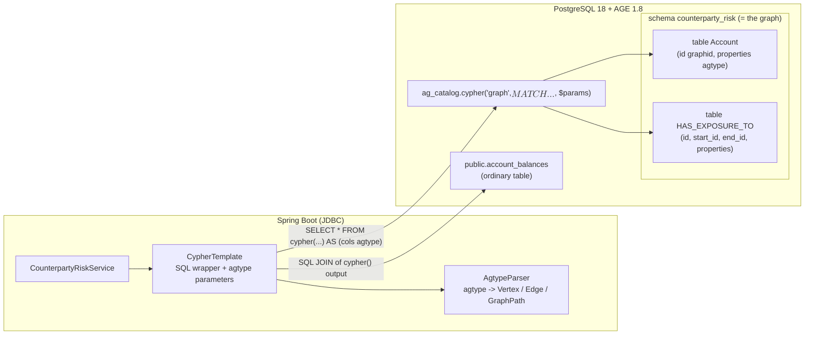

# Apache AGE Graph-in-PostgreSQL Module (`apache-age`)

[](https://openjdk.org/projects/jdk/25/)
[](https://spring.io/projects/spring-boot)
[](https://age.apache.org/)
[](https://www.postgresql.org/)

**[Apache AGE](https://age.apache.org/)** ("A Graph Extension") adds graph storage and the **openCypher** query language to PostgreSQL. Graphs live in ordinary Postgres tables, Cypher runs through a SQL function, and graph data can be joined with relational tables and written in the same transaction.

This module rebuilds the [`neo4j`](../neo4j/README.md) module's **counterparty-risk network** in AGE, with the same data and expected answers, so the two can be compared directly. It then tests what AGE adds and where it differs. It runs on **Spring Boot 4.1.1** (JDBC) and **Java 25**, against `apache/age:release_PG18_1.8.0` (AGE 1.8.0, PostgreSQL 18).

---

## 🏛️ How AGE works



* **A graph is a schema; each label is a table.** `create_graph('counterparty_risk')` creates a schema. `Account` vertices are rows of `counterparty_risk."Account"`, which inherits from `_ag_label_vertex`. Edges get `start_id`/`end_id` columns with btree indexes.
* **Cypher runs inside SQL:** `SELECT * FROM ag_catalog.cypher('graph', $$ <cypher> $$, <params>) AS (col agtype, ...)`.
* **Results are `agtype`:** JSON with `::vertex`, `::edge`, `::path` and `::numeric` suffixes. `AgtypeParser` turns them into `Vertex`, `Edge`, `GraphPath`, maps, lists and Java numbers. A suffix inside a string value, such as `"a::vertex"`, stays text.

---

## ⚡ Key Scenarios Tested & Validated

26 tests: 6 unit tests for the parser, and 20 integration tests against a live AGE container.

### 1. The neo4j module's scenarios, same answers (`CounterpartyRiskIntegrationTest`)
| Scenario | Cypher in AGE | Result (same as neo4j) |
| :--- | :--- | :--- |
| Contagion ring | `MATCH path = (a {accountNumber: $acc})-[:HAS_EXPOSURE_TO*2..6]->(a) UNWIND nodes(path) AS n RETURN DISTINCT n.accountNumber` | `ACC-GRAPH-001/002/003` |
| Shortest contagion path | No `shortestPath()` in AGE: `MATCH p = (s)-[:HAS_EXPOSURE_TO*1..10]-(t) RETURN p ORDER BY length(p) LIMIT 1` | `NODE-1 → 2 → 3 → 4`, beating a 4-hop alternative. Undirected like the neo4j query, so it also works in reverse. With a 2-hop limit it returns nothing |
| Blast radius | `MATCH (a {accountNumber: $acc})-[:HAS_EXPOSURE_TO*1..3]->(d) RETURN DISTINCT d.accountNumber` | `SUB-1`, `SUB-2` |

Also covered:
* **Upserts:** `MERGE` followed by `SET` is idempotent for vertices and edges.
* **Property changes:** `SET`/`REMOVE` change properties; `DETACH DELETE` removes a vertex and its edges.
* **`reduce()` over path edges:** the largest exposure chain reaching each downstream account. `C-3` is reached for 650 through `C-2`, beating the direct edge of 100.
* **Aggregation:** count and `sum` per relationship type.
* **Graph + SQL in one statement:** Cypher's downstream accounts, joined with `public.account_balances` through `agtype_to_text`, sorted by balance. Accounts with no balance row, and accounts more than 3 hops away, drop out.
* **One transaction:** a Cypher write and a relational insert roll back together.

### 2. openCypher coverage and differences (`CypherFeaturesIntegrationTest`)
* **Result types:** vertices, edges and paths come back typed, with consistent ids (`edge.startId == vertex.id`).
* **Parameter binding:** a `PGobject` typed `agtype` works with a bare `?` and with `?::agtype`; the same JSON bound as varchar fails both ways.
* **Clauses:** `OPTIONAL MATCH` (a row is kept with `NULL`), `WITH`, `UNWIND`, `collect`, `avg`, `CASE`, list comprehensions and `range()`.
* **Paths:** bounded variable-length paths, undirected traversal, `nodes(p)` and `length(p)`.
* **Parameters:** one agtype map holds strings, numbers and lists. The same statement runs 8 times, past pgjdbc's server-side prepare threshold.
* **Storage:** graph labels appear in `ag_catalog.ag_label` as tables, and plain SQL over `"Person"` / `"KNOWS"` sees the same data Cypher does.
* **Setup:** AGE is preloaded, `public` comes first on the `search_path`, and the extension version is 1.8.0.

### 3. Indexes and bulk load (`IndexAndBulkLoadIntegrationTest`)
* **Index plans** (checked with `EXPLAIN`):
  * **Map pattern:** `MATCH (a:Account {accountNumber: 'X'})` compiles to `properties @> {...}` and uses the **GIN** index on `properties`.
  * **`WHERE` equality:** `WHERE a.accountNumber = 'X'` compiles to `agtype_access_operator(...)` and uses the **btree expression** index.
  * **Containment off:** with `SET age.enable_containment = off`, the map pattern also compiles to the accessor form and uses the btree index.
* **CSV bulk load:** `load_labels_from_file` and `load_edges_from_file` load vertices and edges from files. **Every loaded property is a string**, including numbers, so a `tier` of `1` comes back as `"1"`. Convert with `toInteger()`/`toFloat()` in Cypher before doing arithmetic.

---

## 🔀 AGE vs Neo4j: what changes

| | Neo4j (`neo4j` module) | AGE (this module) |
| :--- | :--- | :--- |
| Query entry point | Cypher over Bolt | Cypher inside SQL: `SELECT * FROM cypher('graph', $$ ... $$, $params) AS (col agtype, ...)` |
| Result shape | Driver infers columns | Every call names its columns in the `AS (...)` list |
| Parameters | Named driver parameters | One agtype map, bound as a `PGobject` of type `agtype` (with or without a `?::agtype` cast). A value bound as varchar fails either way: a bare `?` finds no matching `cypher()` function, and `?::agtype` gives *"third argument of cypher function must be a parameter"* |
| Shortest path | `shortestPath()` | Not supported (syntax error). Enumerate bounded paths and use `ORDER BY length(p) LIMIT 1`, whose cost grows quickly with the hop limit |
| Labels per node | Several | One. `CREATE (:Person:Employee)` is an error |
| `MERGE … ON MATCH SET` | Works | **Fails in AGE 1.8.0** when the node already exists (*"attribute 1 of type record has wrong type"*). `ON CREATE SET` works. Workaround: `MERGE` then `SET x = coalesce(x, …)` |
| Query text | Any string | Dollar-quoted, so it can't contain `$$`; `CypherTemplate` rejects it |
| Joining with SQL tables | Not possible | A normal SQL join on `cypher()` output, in the same transaction |
| Indexes | `CREATE INDEX FOR (n:Label) ON (n.prop)` | PostgreSQL indexes on the label table: GIN on `properties`, or btree on `agtype_access_operator(properties, '"prop"')` |
| Bulk import | `LOAD CSV` with types | `load_labels_from_file`/`load_edges_from_file`, reading from `/tmp/age/` only; every value becomes a string |

---

## 🛠️ Connection setup

```yaml
spring.datasource.hikari.connection-init-sql: SET search_path = public, ag_catalog
```

* **`public` first.** With `ag_catalog` first, as AGE's docs suggest, an unqualified `CREATE TABLE` lands in AGE's catalog schema. Here AGE functions are called as `ag_catalog.cypher(...)` instead.
* **No `LOAD 'age'`.** The `apache/age` image preloads the extension (`shared_preload_libraries=age`). AGE's docs recommend running `LOAD 'age'` in every session on servers that don't preload it (it needs sufficient privileges). In practice, before the test container kept the preload setting, every test except the preload check still passed without preloading or `LOAD`, so on 1.8.0 the library seems to load when first used. The documented setup is still the safer choice.
* **Testcontainers.** `PostgreSQLContainer` replaces the image's start command, so the test configuration passes `-c shared_preload_libraries=age` again, together with the container's `fsync=off`.
* **Startup setup.** `CounterpartyRiskService` runs `CREATE EXTENSION IF NOT EXISTS age` and creates the graph, labels and indexes. All of these are safe to repeat.

| Variable | Default |
| :--- | :--- |
| `AGE_JDBC_URL` | `jdbc:postgresql://localhost:5432/agedb` |
| `AGE_USERNAME` / `AGE_PASSWORD` | `age` / `age` |
| `AGE_GRAPH` | `counterparty_risk` |

---

## 🧪 Running

```bash
mvn verify -pl apache-age -am      # Docker required; pulls apache/age:release_PG18_1.8.0
```

The app itself has no web server: on startup it creates the extension, graph, labels, indexes and the balances table, then exits. The features are exercised by the tests. `TestAgeApplication` (in `src/test`) runs that startup against a throwaway container. To point it at your own server:

```bash
docker run -d -p 5432:5432 -e POSTGRES_USER=age -e POSTGRES_PASSWORD=age -e POSTGRES_DB=agedb apache/age:release_PG18_1.8.0
```
