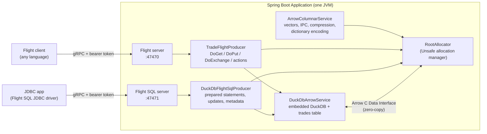

# Apache Arrow & Arrow Flight Module (`apache-arrow`)

[](https://openjdk.org/projects/jdk/25/)
[](https://spring.io/projects/spring-boot)
[](https://arrow.apache.org/)
[](https://duckdb.org/)

**[Apache Arrow](https://arrow.apache.org/)** is not a database. It is a language-independent **columnar memory format**, used by analytics engines (DuckDB, Spark, pandas/Polars, Dremio, DataFusion) so they can exchange data without converting it row by row. **[Arrow Flight](https://arrow.apache.org/docs/format/Flight.html)** is a gRPC protocol for moving Arrow record batches between processes. **[Flight SQL](https://arrow.apache.org/docs/format/FlightSql.html)** builds a SQL interface on Flight, with JDBC and ODBC drivers.

This module covers all three with **Arrow Java 19.0.0** on **Java 25** and **Spring Boot 4.1.1**. **DuckDB** is the embedded engine behind the servers. Everything runs in one JVM; no containers are needed.

---

## 🏛️ Architecture



At startup `DuckDbArrowService` creates a deterministic `trades` table in DuckDB (100,000 rows by default, 50,000 in tests). Both servers use one authenticator: Basic username/password on the handshake, then a generated bearer token on every later call.

---

## ⚡ Key Scenarios Tested & Validated

Tests that allocate Arrow memory do it in a child allocator and check it's back to zero afterwards. The Flight SQL server's allocator is checked after every test, and the Flight server's after a dataset is dropped.

### 1. Columnar format (`ArrowColumnarIntegrationTest`)
* **Allocator:** buffers come from `UnsafeAllocationManager` (see [Java 25 notes](#-java-25-notes)).
* **Vectors and nulls:** trades become column vectors (`VarChar`, `Decimal(12,2)`, `BigInt`, `DateDay`) and back. A null `venue` only clears a validity bit: 2,500 nulls in 10,000 rows.
* **Zero-copy slicing:** slicing a fixed-width column allocates nothing, and the slice's data buffer points into the original at `offset × 8` bytes. Slicing whole rows allocates only a new offsets buffer for each string column (offsets must be rebased to 0); the string bytes are shared.
* **IPC formats:** the STREAM and FILE formats both round-trip 10,000 trades in 5 batches. The file is framed by the `ARROW1` magic bytes and has a footer indexing its batches.
* **Compression:** LZ4_FRAME and ZSTD buffer compression each make the IPC output **less than half** the uncompressed size, and the data round-trips unchanged.
* **Dictionary encoding:** the ticker column becomes 1-byte indices plus a 5-entry dictionary (**under 75%** of the plain size) and decodes back to the original strings.

### 2. DuckDB ⇄ Arrow interop (`DuckDbArrowInteropIntegrationTest`)
* **DuckDB → Arrow:** `SELECT * FROM trades` is exported as Arrow batches of up to 8,192 rows (50,000 rows in 7 batches). DuckDB's SQL types map to the same Arrow types the Java code uses.
* **Arrow → DuckDB:** Java-built Arrow batches are registered as a view (`registerArrowStream`), and DuckDB SQL (`GROUP BY ticker`, `sum(price * quantity)`) runs over them directly.
* **Consumed once:** a registered Arrow stream is used up by its first scan; a second query fails.
* **Ownership:** `Data.exportArrayStream` hands the reader to the exported stream, and DuckDB releases the stream when its scan finishes. Closing the reader yourself afterwards fails, so `withArrowView` releases the stream only if it was never read, then frees its 64-byte struct. A view that was registered but never queried doesn't leak either.

### 3. Arrow Flight (`ArrowFlightIntegrationTest`)
| RPC | What it does here | Asserted |
| :--- | :--- | :--- |
| Handshake | Basic auth → bearer token | No token, or a wrong password → `UNAUTHENTICATED` |
| `GetFlightInfo(path "trades")` | The DuckDB table split into **one endpoint per ticker** | 5 endpoints, exact `totalRecords`, schema |
| `DoGet` ×5 in parallel | Each endpoint streamed on its own thread | Every row matches its endpoint's ticker; the row count and `sum(quantity)` match DuckDB |
| `GetFlightInfo(command <sql>)` + `DoGet` | Any SQL run in DuckDB | Grouped totals match |
| `DoPut(path <name>)` | Upload a dataset (3 batches); the server keeps it as record batches | It appears in `ListFlights` and fetches back identical |
| `DoAction` | `dataset-stats`, `drop-dataset` | Stats JSON; after a drop, `NOT_FOUND` and the server's memory back to 0 |
| `DoExchange` | Send trade batches, get back `trade_id, notional` for each batch | 3 batches in, 3 out, `notional = price × quantity` |
| Errors | Unknown flight, bad SQL, unknown action, `DoPut` to the read-only `trades` | `NOT_FOUND`, `INVALID_ARGUMENT`, `UNIMPLEMENTED`, `INVALID_ARGUMENT` |

### 4. Flight SQL with the JDBC driver (`FlightSqlJdbcIntegrationTest`)
A plain JDBC client (`jdbc:arrow-flight-sql://…`) using the `flight-sql-jdbc-core` driver:
* **Queries:** aggregate results and column types (`VARCHAR`, `DECIMAL`, `DATE`) match DuckDB queried directly.
* **Parameters:** `PreparedStatement` parameters (`VARCHAR`, `BIGINT`, `DATE`) are sent to the server in a DoPut and bound in DuckDB. Results match the same prepared query run directly.
* **Updates:** `CREATE TABLE`, a 3-row `executeBatch` insert (one DoPut, one DuckDB transaction), `UPDATE` (returns 2) and `DROP TABLE` all go through Flight SQL.
* **Metadata:** `DatabaseMetaData.getTables` is answered from DuckDB's `information_schema`.
* **Cleanup and errors:** prepared statements are closed on the server; a wrong password fails with `UNAUTHENTICATED`; bad SQL reports DuckDB's error.

Driver behaviours the server has to handle, all found through these tests:
- **Every statement is prepared.** The driver runs even a plain `Statement` as create → (bind) → execute → close.
- **Updates get a follow-up DoGet.** After `executeUpdate`'s DoPut, the driver also calls `GetFlightInfo` and `DoGet` on the same statement. The server answers that DoGet with an empty result, so the DDL/DML doesn't run twice.
- **Update counts must not be negative.** DuckDB returns `-1` from `executeUpdate` for DDL. The server reports 0, as JDBC expects. Otherwise the driver fails an Avatica assertion and quietly re-runs the whole statement.
- **Batch counts are totals.** `executeBatch()` returns one total for the DoPut (`[3]`), not one count per row.

### 5. Transfer benchmark (`TransferBenchmarkIntegrationTest`)
Reads the whole trades table four ways and asserts they return **identical data** (row count, `sum(quantity)`, `sum(price)`). Timings are logged, not asserted. One run on an Apple-silicon laptop, 50,000 rows, second (warm) pass:

| Method | Time |
| :--- | ---: |
| JDBC rows (DuckDB driver, a getter per value) | 92 ms |
| Arrow export (DuckDB C Data Interface, in-process) | 9 ms |
| Arrow Flight `DoGet`, 5 endpoints in parallel over localhost gRPC | 47 ms |
| Flight SQL JDBC driver (JDBC API over Arrow batches) | 64 ms |

---

## ☕ Java 25 notes

| Issue | What this module does |
| :--- | :--- |
| `arrow-memory-netty` fails with `ClassCastException: PooledDirectByteBuf cannot be cast to PooledUnsafeDirectByteBuf` under the Netty 4.2 that Boot 4.1.1 manages | Excludes it from `flight-core`, `flight-sql` and the JDBC driver, adds `arrow-memory-unsafe`, and builds the `RootAllocator` with `UnsafeAllocationManager.FACTORY` explicitly. A test asserts which manager is used |
| Arrow needs reflective access to `java.nio` | `--add-opens=java.base/java.nio=ALL-UNNAMED` in the Surefire `argLine`, in `spring-boot:run`'s `jvmArguments`, and as `Add-Opens` in the jar manifest |
| DuckDB loads a native library (a warning on 24+, to be blocked later) | `--enable-native-access=ALL-UNNAMED` in the same three places (`Enable-Native-Access` in the manifest) |
| Arrow's `MemoryUtil` calls `sun.misc.Unsafe` methods that are marked for removal | It works on 25, with a startup warning. A future JDK may break it until Arrow moves off `sun.misc.Unsafe` |
| gRPC server threads are daemon threads and there is no web server | `spring.main.keep-alive: true` so `java -jar` stays up |

gRPC 1.83.1, Netty 4.2.17, protobuf 4.35.1 and Avatica 1.26.0 all resolve under Boot's dependency management without conflicts.

---

## 🛠️ Configuration

| Variable | Property | Default |
| :--- | :--- | :--- |
| `ARROW_FLIGHT_PORT` | `arrow.flight.port` | `47470` (0 = pick a free port) |
| `ARROW_FLIGHT_SQL_PORT` | `arrow.flight-sql.port` | `47471` |
| `ARROW_USERNAME` / `ARROW_PASSWORD` | `arrow.username` / `arrow.password` | `arrow` / `arrow` |
| `ARROW_SAMPLE_ROWS` | `arrow.sample-rows` | `100000` |
| — | `arrow.batch-size` | `8192` rows per exported batch |

The servers are plaintext gRPC (`useEncryption=false` in the JDBC URL). This is a local demo, so change the default credentials before exposing the ports.

---

## 🧪 Running

```bash
mvn verify -pl apache-arrow -am          # 22 tests, ~20 s, no Docker needed

mvn -pl apache-arrow -am package -DskipTests
java -jar apache-arrow/target/apache-arrow-0.0.1-SNAPSHOT.jar   # flags come from the jar manifest
```

I verified the jar with a separate Java Flight client and the Flight SQL JDBC driver. Other Flight clients (pyarrow, Go, Rust) use the same `grpc://localhost:47470` address and Basic-then-bearer auth. The JDBC URL is:

```
jdbc:arrow-flight-sql://localhost:47471/?useEncryption=false&user=arrow&password=arrow
```
