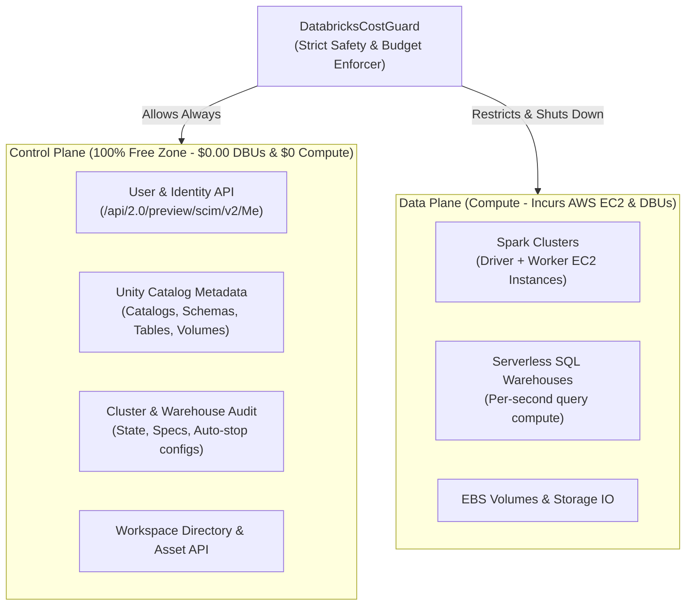

# Databricks Lakehouse Free-Zone Module (`databricks`)

## Overview
The `databricks` module provides a production-grade Spring Boot and Java 25 integration with **Databricks Lakehouse**, specifically engineered with strict **Free-Zone Cost Guardrails** (`DatabricksCostGuard`) to ensure developers and data engineers can safely test and validate Databricks capabilities **without incurring unintended AWS cloud compute or Databricks Unit (DBU) charges**.

Configured specifically for workspace:
**`https://dbc-06bb552d-57db.cloud.databricks.com/?o=2102279257150258`**
* **Host**: `https://dbc-06bb552d-57db.cloud.databricks.com`
* **Workspace / Org ID**: `2102279257150258`

---

## 💰 Databricks Cost Anatomy: Understanding What Charges You

Databricks runs as a managed platform on top of cloud infrastructure (AWS in this workspace). Understanding how charges occur is essential:



### 1. Control Plane ($0.00 DBUs & $0.00 Compute)
* **Unity Catalog Metadata**: Listing catalogs (`samples`, `system`, `main`), schemas (`tpch`, `nyctaxi`), tables, columns, and volume paths queries only Databricks' control-plane metadata database. **It requires no running cluster and costs $0.00**.
* **Workspace & SCIM API**: Checking connectivity, listing workspace folders, and user identity verification are completely free.
* **Cluster & Warehouse Inspection**: Listing clusters, auditing configurations, and reading status logs cost $0.00.

### 2. Data Plane (Compute Charges)
* **Spark Clusters**: Every active cluster launches AWS EC2 instances (e.g., `m5.large`, `i3.xlarge`). AWS charges for every second the EC2 instance is running, plus Databricks DBUs.
* **Why Users Incur Charges**:
  1. **Idle Orphan Clusters**: Leaving a cluster running without auto-termination (or with a 120-minute default timeout) runs AWS EC2 overnight.
  2. **Multi-Node Compute**: Running multiple workers multiplies instance counts ($N \times \text{EC2}$).
  3. **Expensive Node Types**: Accidentally launching GPU (`g4dn`, `p3`) or memory-heavy nodes (`r5.24xlarge`).
  4. **Runaway Queries**: Executing unpartitioned scans with unbounded execution timeouts.

---

## 🛡️ The 7 Free-Zone Guardrails (`DatabricksCostGuard`)

This module enforces 7 programmatic guardrails before any operation reaches the Databricks API:

| Guardrail | Mechanism | Violation Action |
| :--- | :--- | :--- |
| **1. Zero-Compute First** | Directs testing to Unity Catalog & SCIM metadata APIs. | $0.00 cost guaranteed. |
| **2. Single-Node Enforcer** | Enforces `num_workers = 0`, `spark.databricks.cluster.profile: singleNode`, and `spark.master: local[*]`. | Throws `CostGuardViolationException(FORBIDDEN_MULTI_NODE)`. |
| **3. Minimal Auto-Termination** | Rejects `autotermination_minutes = 0` (infinite run) or `> 10` minutes. | Throws `CostGuardViolationException(MISSING_AUTO_TERMINATION / EXCESSIVE_AUTO_TERMINATION)`. |
| **4. Instance Type Allowlist** | Only allows micro/lightweight nodes (`t3.medium`, `t3.large`, `m5.large`, `i3.xlarge`). | Throws `CostGuardViolationException(DISALLOWED_NODE_TYPE)`. |
| **5. Query Timeout & Row Bound** | Sets maximum SQL execution timeout (`<= 30s`) and result cap (`<= 100 rows`). | Throws `CostGuardViolationException(EXCESSIVE_SQL_TIMEOUT / EXCESSIVE_QUERY_ROWS)`. |
| **6. Lifecycle Auto-Teardown** | Functional pattern `withSafeCluster()` and Spring `@PreDestroy` hook stop clusters. | Shuts down active clusters on test completion or shutdown. |
| **7. Emergency Killswitch** | Dedicated `terminateAllRunningClusters()` and REST endpoint `/api/databricks/emergency-shutdown`. | Immediately scans and terminates all active/pending clusters in the workspace. |

---

## 🏗️ Architecture & Component Overview

```
databricks/
├── src/main/java/com/rixon/learn/spring/data/databricks/
│   ├── DatabricksApplication.java              # Spring Boot Application Entry Point
│   ├── config/
│   │   ├── DatabricksProperties.java           # Configuration & Free-Tier threshold properties
│   │   └── DatabricksConfig.java               # Bean wiring & Auto-Shutdown lifecycle hook
│   ├── guard/
│   │   ├── DatabricksCostGuard.java            # Cost validation & Safety auditor
│   │   └── CostGuardViolationException.java    # Free-Zone policy violation exception
│   ├── model/
│   │   ├── ClusterSpec.java                    # Single-Node cluster specification DTO
│   │   ├── ClusterInfo.java                    # Cluster state & configuration DTO
│   │   ├── ClusterSafetyReport.java            # Individual cluster safety audit report
│   │   ├── CostAuditReport.java                # Overall workspace risk and cost assessment
│   │   ├── CatalogInfo.java                    # Unity Catalog catalog metadata DTO
│   │   ├── SchemaInfo.java                     # Unity Catalog schema metadata DTO
│   │   ├── TableInfo.java                      # Unity Catalog table & column metadata DTO
│   │   ├── SqlExecutionRequest.java            # Guarded SQL execution request
│   │   ├── SqlExecutionResult.java             # SQL execution results & timings
│   │   └── WorkspaceUserInfo.java              # Databricks SCIM user profile DTO
│   ├── service/
│   │   ├── DatabricksRestClient.java           # Resilient HTTP client for Databricks REST APIs
│   │   ├── DatabricksWorkspaceService.java     # Free Control Plane operations (Unity Catalog & SCIM)
│   │   ├── DatabricksClusterManager.java       # Safe compute manager with Emergency Killswitch
│   │   └── DatabricksSqlService.java           # Guarded SQL Execution via REST API & JDBC
│   └── controller/
│       └── DatabricksController.java           # REST endpoints for status, audit, and shutdown
```

---

## 🔑 How to Connect Your Workspace Account

### Step 1: Generate a Personal Access Token (PAT)
1. Log in to your Databricks workspace:
   `https://dbc-06bb552d-57db.cloud.databricks.com/?o=2102279257150258`
2. Click on your profile name in the top right corner and select **User Settings**.
3. In the sidebar under **User**, select **Developer**.
4. Next to **Access tokens**, click **Manage** -> **Generate new token**.
5. Give it a comment (e.g. `data-access-testing`) and set a short lifetime (e.g. 7 days).
6. Copy the token (starts with `dapi...`).

### Step 2: Configure Your Token via `.env` (No manual export needed!)
You do **not** need to run `export` every time. The module automatically discovers and loads environment variables from a `databricks/.env` file (or `.env` in the project root).

1. Copy the provided template:
   ```bash
   cp databricks/.env.example databricks/.env
   ```
2. Open `databricks/.env` and paste your token:
   ```env
   DATABRICKS_TOKEN=dapi1234567890abcdef...
   ```
3. *Security Guarantee*: `**/.env` is listed in `.gitignore`, ensuring your secret token is never accidentally staged or committed to Git.

*(Alternatively, you can still export `export DATABRICKS_TOKEN="dapi..."` in your shell, which takes precedence if set).*

---

## 🧪 Testing & Validation

### 1. Offline Unit & Contract Tests (Zero Cloud Calls)
Runs offline against MockRestServiceServer and unit test harnesses. **100% green without needing any cloud credentials**:

```bash
mvn test -pl databricks -Dtest="!DatabricksLiveIntegrationTest"
```

### 2. Live Cloud Verification (Free Control-Plane Only)
When `DATABRICKS_TOKEN` is set, runs against `https://dbc-06bb552d-57db.cloud.databricks.com`:

```bash
DATABRICKS_TOKEN="dapi..." mvn test -pl databricks -Dtest=DatabricksLiveIntegrationTest
```
* Queries `/api/2.0/preview/scim/v2/Me` to confirm user identity.
* Queries Unity Catalog `/api/2.1/unity-catalog/catalogs` to list catalogs (`samples`, `system`).
* Audits all workspace clusters to verify that zero idle clusters are left running.

---

## ⚡ Interactive REST API Endpoints

When the application is running (`mvn spring-boot:run -pl databricks`):

| Endpoint | Method | Description | Cost |
| :--- | :--- | :--- | :--- |
| `/api/databricks/user` | `GET` | Authenticated user profile | $0.00 (Free Zone) |
| `/api/databricks/catalogs` | `GET` | List Unity Catalog catalogs | $0.00 (Free Zone) |
| `/api/databricks/schemas?catalog=samples` | `GET` | List schemas (`tpch`, `nyctaxi`) | $0.00 (Free Zone) |
| `/api/databricks/tables?catalog=samples&schema=tpch` | `GET` | List tables & column definitions | $0.00 (Free Zone) |
| `/api/databricks/clusters` | `GET` | List all clusters | $0.00 (Free Zone) |
| `/api/databricks/audit` | `GET` | Comprehensive Cost & Safety Audit | $0.00 (Free Zone) |
| `/api/databricks/emergency-shutdown` | `POST` | **Killswitch**: Terminates all active compute | $0.00 (Stops all compute spend) |
| `/api/databricks/sql` | `POST` | Execute guarded query | Guarded (<30s, <=100 rows) |

---

## 🛑 Emergency Killswitch Usage

If you ever suspect a cluster was left running in your account, you can stop all compute immediately via:

1. **CLI / Terminal**:
   ```bash
   curl -X POST http://localhost:8089/api/databricks/emergency-shutdown
   ```
2. **Java Code**:
   ```java
   clusterManager.terminateAllRunningClusters();
   ```
This immediately queries the cluster list and issues `POST /api/2.0/clusters/delete` to every active or starting cluster in the workspace.
