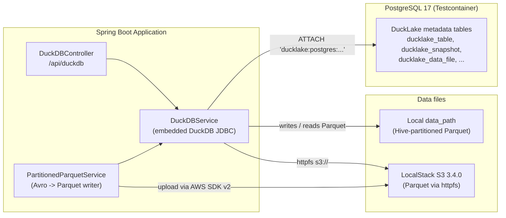

# DuckLake Lakehouse Module (`ducklake`)

[](https://openjdk.org/projects/jdk/25/)
[](https://spring.io/projects/spring-boot)
[](https://duckdb.org/)
[](https://testcontainers.com/)

Reference implementation of **[DuckLake](https://ducklake.select/)**, the open table format from the DuckDB team. DuckLake keeps table data as plain Parquet files and puts all table metadata (snapshots, schemas, file lists, partition info) in an ordinary SQL database. Here that database is **PostgreSQL**. The DuckDB engine is embedded in a **Spring Boot 4.1.1** app on **Java 25**.

Iceberg and Delta Lake (see [`apache-iceberg`](../apache-iceberg/README.md) and [`delta-lake`](../delta-lake/README.md)) keep their metadata as JSON/Avro files in object storage. DuckLake replaces that metadata tree with SQL tables, so commits are ordinary database transactions.

> Originally developed as the standalone `ducklake_poc` repository. It was imported here with its full commit history (`git subtree`).

---

## 🏛️ Architecture



---

## ⚡ Key Scenarios Tested & Validated

All scenarios run against live **PostgreSQL** (`postgres:17`) and **LocalStack** (`localstack/localstack:3.4.0`) containers.

### 1. DuckLake catalog on PostgreSQL (`DucklakePostgresTest`)
On startup `DuckDBService` installs the `ducklake` and `postgres` extensions, creates a DuckDB `POSTGRES` secret, and attaches the catalog:

```sql
ATTACH 'ducklake:postgres:dbname=... host=... port=... user=... password=...'
    AS pg_ducklake (DATA_PATH 'data_files/');
USE pg_ducklake;
CREATE TABLE sales_data (id INTEGER, product VARCHAR, sale DECIMAL(10,2), sale_date DATE, region VARCHAR);
ALTER TABLE sales_data SET PARTITIONED BY (year(sale_date), region);
```

The test checks that:
* the rows can be queried back through DuckDB.
* after `CALL ducklake_flush_inlined_data('pg_ducklake')`, there is **one Parquet file per partition** (3 regions give 3 files, via `ducklake_list_files`). DuckLake inlines small inserts into the catalog database until they are flushed.
* the table metadata is stored **in PostgreSQL**: `ducklake_table` has the `sales_data` row when queried directly over JDBC.

### 2. Hive-partitioned Parquet on local disk and S3 (`PartitionedParquetServiceTest`)
* Generates Avro `GenericRecord`s and writes Snappy-compressed Parquet files per partition (`category=.../department=.../`). The writer uses Parquet's `LocalOutputFile` rather than the Hadoop `FileSystem` API, which fails on Java 24+ because `Subject.getSubject()` is no longer supported.
* Uploads the partition tree to LocalStack S3 and queries it through a view over `parquet_scan('<root>/**/*.parquet', hive_partitioning=1)`.
* Checks **partition pruning**: grouping gives 15 `category`/`department` partitions (5 × 3), and filtering on `category = 'category_1'` returns only its 3 partitions.

### 3. Querying S3 and CSV data (`DuckDBServiceIntegrationTest`)
* Configures DuckDB `httpfs` against the LocalStack endpoint (`s3_endpoint`, `s3_url_style='path'`) and creates tables from S3 objects and from local CSV files.

### 4. Wide-table analytics (`DuckDBLargeTableTest`)
* Builds a table of 1,000 rows by 100 attribute columns and runs `COUNT`, projection, point-filter, and `MIN`/`MAX`/`COUNT` aggregate queries.

### 5. REST API (`DuckDBControllerIntegrationTest`)
MockMvc tests for the endpoints:

| Method | Path | Purpose |
| :--- | :--- | :--- |
| `POST` | `/api/duckdb/tables?tableName=&s3Path=&format=` | Create a table from an S3 object (CSV or Parquet) |
| `POST` | `/api/duckdb/query` | Run an ad-hoc SQL query |
| `GET` | `/api/duckdb/tables/{tableName}` | Read the rows of a table |

---

## 🛠️ Configuration

`DuckDBConfig` binds properties with the `duckdb.` prefix. The default `catalog-type` is `memory`, which uses a plain in-memory DuckDB with no DuckLake catalog. The tests switch it to `postgres` and fill in the connection details from the container. For a real deployment, supply credentials from the environment, never from committed files:

```properties
duckdb.catalog-type=postgres
duckdb.host=${DUCKLAKE_PG_HOST}
duckdb.port=${DUCKLAKE_PG_PORT:5432}
duckdb.database=${DUCKLAKE_PG_DB}
duckdb.catalog-username=${DUCKLAKE_PG_USER}
duckdb.catalog-password=${DUCKLAKE_PG_PASSWORD}
duckdb.catalog-data-files-path=data_files/
```

Generated Parquet output (`data_files/`) is git-ignored.

---

## 🧪 Running the Tests

Docker must be running. The DuckDB extensions (`ducklake`, `postgres`, `httpfs`) download on first use, so the first run needs network access.

```bash
mvn verify -pl ducklake -am
```
