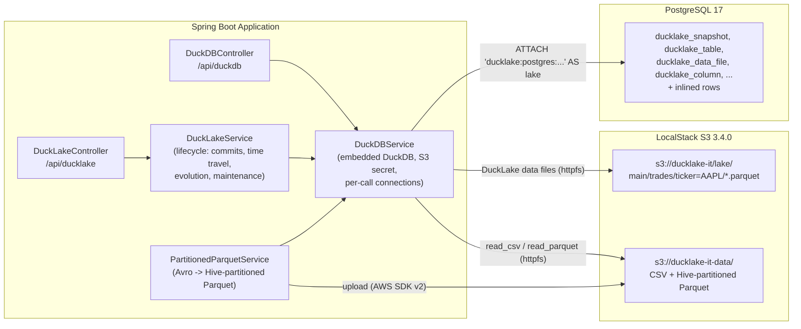

# DuckLake Lakehouse Module (`ducklake`)

[](https://openjdk.org/projects/jdk/25/)
[](https://spring.io/projects/spring-boot)
[](https://duckdb.org/)
[](https://testcontainers.com/)

Reference implementation of **[DuckLake](https://ducklake.select/)**, the open table format from the DuckDB team. DuckLake keeps table data as plain Parquet files and puts all table metadata (snapshots, schemas, file lists, partition info, column statistics) in an ordinary SQL database. Here that database is **PostgreSQL** and the Parquet files live on **S3** (LocalStack). The DuckDB engine is embedded in a **Spring Boot 4.1.1** app on **Java 25**.

Iceberg and Delta Lake (see [`apache-iceberg`](../apache-iceberg/README.md) and [`delta-lake`](../delta-lake/README.md)) keep their metadata as JSON/Avro files next to the data in object storage. DuckLake replaces that metadata tree with SQL tables, so a commit is a single database transaction and there are no manifest files to list or merge.

> Originally developed as the standalone `ducklake_poc` repository. It was imported here with its full commit history (`git subtree`).

---

## 🏛️ Architecture



`DuckDBService` owns one in-memory DuckDB instance. On startup it creates the S3 secret, and `DuckLakeService` attaches the catalog as `lake` (`ATTACH IF NOT EXISTS`, safe on every restart). Each call gets its own connection via `DuckDBConnection.duplicate()`, so the attached catalog and secrets are shared, while a transaction stays on one connection. Startup fails if the catalog cannot be attached; nothing is silently skipped.

---

## ⚡ Key Scenarios Tested & Validated

All tests run against live **PostgreSQL** (`postgres:17`) and **LocalStack** (`localstack/localstack:3.4.0`) containers. The DuckLake data path is `s3://ducklake-it/lake/` and inlining is off (`DATA_INLINING_ROW_LIMIT 0`), so every commit writes real Parquet objects to S3.

### 1. Full table lifecycle (`DuckLakeLifecycleIntegrationTest`)

One ordered test on a `trades` table partitioned by `ticker`:

| Step | DuckLake feature | What is asserted |
| :--- | :--- | :--- |
| 1 | `CREATE TABLE` + `SET PARTITIONED BY (ticker)` in one transaction | Created once; a second call is a no-op |
| 2 | ACID commit | 3 rows in one commit = **one snapshot**, **one Parquet object per partition** in S3 (`ticker=AAPL/`, `NVDA`, `MSFT`) |
| 3 | Small commits | Each commit adds one snapshot and one AAPL file (3 AAPL files, compacted later) |
| 4 | Multi-statement transaction | An `UPDATE` and an `INSERT` land in the same snapshot; the change feed (`table_changes`) shows `update_preimage` 125.00, `update_postimage` 126.50 and `insert` |
| 5 | Rollback + orphan cleanup | A batch that fails on a `NOT NULL` column, and a correction for an unknown trade, both roll back fully: **no new snapshot, no rows**. The failing insert had already written a Parquet object (`ticker=__HIVE_DEFAULT_PARTITION__/`) that the catalog never references; `ducklake_delete_orphaned_files` deletes exactly that object from S3 and keeps files older snapshots still need |
| 6 | Time travel | `AT (VERSION => n)` returns the 3 original rows and the pre-correction price; `AT (TIMESTAMP => ...)` resolves the same snapshot from its `snapshot_time` |
| 7 | Schema evolution | `ADD COLUMN venue` bumps `schema_version` without rewriting files; old rows read `NULL`, and `DESCRIBE ... AT (VERSION => n)` still shows the old 5 columns |
| 8 | Partition evolution | `SET PARTITIONED BY (year(trade_date), month(trade_date))`: the new file goes to `year=2026/month=2/`, every existing `ticker=` file is kept as is |
| 9 | Compaction | `ducklake_merge_adjacent_files` merges the 3 AAPL files into 1; row count unchanged; time travel to the first snapshot still works |
| 10 | Expiry + cleanup | `ducklake_expire_snapshots` removes old snapshots, `ducklake_cleanup_old_files` deletes the 3 replaced AAPL objects **from S3**; time travel to an expired version fails with `No snapshot found` |
| 11 | Catalog in PostgreSQL | Queried directly over JDBC: `ducklake_snapshot` row count equals `lake.snapshots()`, `ducklake_table` has the table, and `ducklake_data_file` has exactly the live files |

A second test covers **data inlining**. With `set_option('data_inlining_row_limit', 100)` on the table, a 2-row insert can be read straight away, but no Parquet file exists and nothing is in S3: the rows are stored in PostgreSQL. `ducklake_flush_inlined_data` then writes them to one Parquet object.

### 2. REST API over DuckLake (`DuckLakeControllerIntegrationTest`)

| Method | Path | Purpose |
| :--- | :--- | :--- |
| `POST` | `/api/ducklake/tables/{table}/trades` | Append trades (JSON array) in one snapshot; creates the table, partitioned by ticker, on first use |
| `GET` | `/api/ducklake/tables/{table}/trades?version=` | Current trades, or time travel to a snapshot |
| `GET` | `/api/ducklake/tables/{table}/files` | Live data files |
| `GET` | `/api/ducklake/snapshots` | Catalog snapshots with their change summaries |

Invalid table names and constraint violations return `400`.

### 3. Hive-partitioned Parquet on local disk and S3 (`PartitionedParquetServiceTest`)
* Generates Avro `GenericRecord`s and writes Snappy-compressed Parquet per partition (`category=.../department=.../`). The writer uses Parquet's `LocalOutputFile` rather than the Hadoop `FileSystem` API, which fails on Java 24+ because `Subject.getSubject()` is no longer supported.
* Uploads the partition tree to S3 and queries it through `read_parquet('<root>/**/*.parquet', hive_partitioning = true)` from both disk and S3.
* Checks **partition pruning** in the query plan: filtering on `category = 'category_1'` reads `3/15` files.

### 4. Querying S3 and CSV data (`DuckDBServiceIntegrationTest`, `DuckDBControllerIntegrationTest`)
* `httpfs` reads CSV from LocalStack using the S3 secret built from `ducklake.s3.*`. No per-session `SET s3_*` calls are needed.
* A missing S3 object is an error, not a silent fallback. A failed `inTransaction` block rolls back.
* `/api/duckdb` endpoints: create a table from a local or `s3://` file, run ad-hoc SQL, read a table. Table names are validated as identifiers.

### 5. Wide-table analytics (`DuckDBLargeTableTest`)
* Generates a 1,000 row by 100 column table with `range()` and runs `COUNT`, projection, point-filter and `MIN`/`MAX` queries.

---

## 📌 Versions

| Component | Version | Where it comes from |
| :--- | :--- | :--- |
| DuckDB engine | `1.5.5` | `org.duckdb:duckdb_jdbc:1.5.5.1` in `pom.xml` (the engine is inside the JDBC jar) |
| `ducklake` extension | build `d8a1881e` | Downloaded by `INSTALL ducklake` from DuckDB's core extension repository |
| DuckLake catalog format | `1.0` | Written by the extension to `ducklake_metadata` (`key = 'version'`) |
| `httpfs` / `postgres_scanner` | `827222f` / `41223e5` | Also downloaded at runtime; not checked |

The JDBC jar fixes the DuckDB version, but not the extensions. DuckDB downloads them on first use into `~/.duckdb/extensions/v1.5.5/`, and it can publish a fixed build for the same release. So a new machine, or a cleared cache, may load a `ducklake` build these tests never ran against.

To catch that, `DuckLakeService` checks the loaded build at startup, before it attaches the catalog:

```
DuckDB v1.5.5 with ducklake extension build d8a1881e
```

If the build differs from `ducklake.expected-extension-version` (env `DUCKLAKE_EXTENSION_VERSION`, default `d8a1881e`), startup fails with a message naming both builds. Set it to an empty value to skip the check. `DuckLakeExtensionVersionTest` covers the match, mismatch and skip cases.

**Upgrading DuckDB or the extension:** bump `duckdb.version` in `pom.xml` and run once with `DUCKLAKE_EXTENSION_VERSION=` so the check is skipped. Read the new build from the startup log, or run `SELECT extension_version FROM duckdb_extensions() WHERE extension_name = 'ducklake'`. Then run `mvn verify -pl ducklake -am`, and once it passes, put the new build in `DuckLakeProperties`, `application.yml` and the table above.

---

## 🛠️ Configuration

`DuckLakeProperties` binds the `ducklake.*` properties. By default (`application.yml`) the app needs **no infrastructure**: the catalog is a local DuckDB file (`data_files/catalog.ducklake`), data files go to `data_files/lake/`, and small inserts are inlined into the catalog until flushed. Environment variables switch to PostgreSQL and S3:

| Variable | Property | Default |
| :--- | :--- | :--- |
| `DUCKLAKE_CATALOG_TYPE` | `ducklake.catalog.type` | `duckdb` (or `postgres`) |
| `DUCKLAKE_PG_HOST` / `_PORT` / `_DB` | `ducklake.catalog.host` / `port` / `database` | `localhost` / `5432` / `ducklake_catalog` |
| `DUCKLAKE_PG_USER` / `_PASSWORD` | `ducklake.catalog.username` / `password` | — |
| `DUCKLAKE_DATA_PATH` | `ducklake.data-path` | `data_files/lake/` (or `s3://bucket/prefix/`) |
| `DUCKLAKE_S3_ENDPOINT` | `ducklake.s3.endpoint` | empty = no S3 secret (e.g. `localhost:4566`) |
| `DUCKLAKE_S3_REGION` / `_ACCESS_KEY_ID` / `_SECRET_ACCESS_KEY` | `ducklake.s3.*` | `us-east-1` / — / — |
| `DUCKLAKE_EXTENSION_VERSION` | `ducklake.expected-extension-version` | `d8a1881e` (empty = no check) |

`ducklake.data-inlining-row-limit` sets the catalog-wide inlining threshold (0 disables it). `ducklake.expected-extension-version` is described under [Versions](#-versions). The PostgreSQL password is passed through a DuckDB `postgres` secret, not embedded in the `ATTACH` string.

Generated output (`data_files/`) is git-ignored.

---

## 🧪 Running

Tests (Docker must be running; the `ducklake`, `postgres` and `httpfs` DuckDB extensions download on first use, so the first run needs network access):

```bash
mvn verify -pl ducklake -am
```

The app, with the local catalog:

```bash
mvn -pl ducklake -am package -DskipTests
cd ducklake   # data_files/ is created in the working directory (git-ignored here)
java -jar target/ducklake-0.0.1-SNAPSHOT.jar

curl -X POST localhost:8080/api/ducklake/tables/trades/trades -H 'Content-Type: application/json' \
  -d '[{"tradeId":"T-1","ticker":"AAPL","price":220.50,"quantity":100,"tradeDate":"2026-01-05"}]'
curl localhost:8080/api/ducklake/snapshots
curl 'localhost:8080/api/ducklake/tables/trades/trades?version=2'
```

`TestDucklakeApplication` (in `src/test`) starts the app against the same PostgreSQL + LocalStack containers the tests use.
