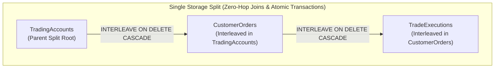

# Google Cloud Spanner Trading Engine (`google-cloud-spanner`)

## Overview
The `google-cloud-spanner` module demonstrates **Google Cloud Spanner**, Google's globally distributed, synchronously replicated NewSQL database offering external consistency (linearizability) using TrueTime.

This module validates:
1. **Interleaved Tables**: Parent-child co-location (`TradingAccounts` -> `CustomerOrders` -> `TradeExecutions`) where child rows reside physically on the same storage split/tablet as the parent. This ensures zero network hops on hierarchy joins and atomic multi-table operations.
2. **TrueTime Commit Timestamps**: Linearizable, globally monotonically increasing commit timestamps (`OPTIONS (allow_commit_timestamp=true)` and `Value.COMMIT_TIMESTAMP`).
3. **Atomic Multi-Table Transactions**: Atomically recording a trade execution, updating parent order fill status, and recalculating account cash balances within a single distributed Spanner `ReadWriteTransaction`.
4. **Declarative Cascade Deletes**: `INTERLEAVE IN PARENT ... ON DELETE CASCADE` guaranteeing transactional cleanup of child orders and executions when an account is deleted.

---

## 🏛️ Technical Capabilities Tested & Validated



### 1. Interleaved Table DDL Hierarchy
```sql
CREATE TABLE TradingAccounts (
    account_id STRING(64) NOT NULL,
    account_name STRING(128) NOT NULL,
    currency STRING(3) NOT NULL,
    balance NUMERIC NOT NULL,
    created_at TIMESTAMP NOT NULL OPTIONS (allow_commit_timestamp=true)
) PRIMARY KEY (account_id);

CREATE TABLE CustomerOrders (
    account_id STRING(64) NOT NULL,
    order_id STRING(64) NOT NULL,
    symbol STRING(16) NOT NULL,
    side STRING(8) NOT NULL,
    price NUMERIC NOT NULL,
    quantity INT64 NOT NULL,
    status STRING(16) NOT NULL,
    created_at TIMESTAMP NOT NULL OPTIONS (allow_commit_timestamp=true)
) PRIMARY KEY (account_id, order_id),
  INTERLEAVE IN PARENT TradingAccounts ON DELETE CASCADE;

CREATE TABLE TradeExecutions (
    account_id STRING(64) NOT NULL,
    order_id STRING(64) NOT NULL,
    execution_id STRING(64) NOT NULL,
    execution_price NUMERIC NOT NULL,
    executed_quantity INT64 NOT NULL,
    executed_at TIMESTAMP NOT NULL OPTIONS (allow_commit_timestamp=true)
) PRIMARY KEY (account_id, order_id, execution_id),
  INTERLEAVE IN PARENT CustomerOrders ON DELETE CASCADE;
```

### 2. TrueTime Atomic Trade Execution
Atomically records trade fills, adjusts account balances, and transitions order statuses across the interleaved split:
```java
TransactionRunner runner = databaseClient.readWriteTransaction();
runner.run(transaction -> {
    // 1. Read parent order and account to verify state
    ...
    // 2. Insert TradeExecution (interleaved child)
    // 3. Update CustomerOrder to FILLED
    // 4. Update TradingAccount cash balance
    transaction.buffer(List.of(insertExecution, updateOrder, updateAccount));
    return null;
});
Timestamp trueTimeCommit = runner.getCommitTimestamp();
```

---

## 🧪 How to Run the Tests

The integration test automatically spins up `gcr.io/cloud-spanner-emulator/emulator:latest` using Testcontainers:

```bash
mvn test -pl google-cloud-spanner
```
