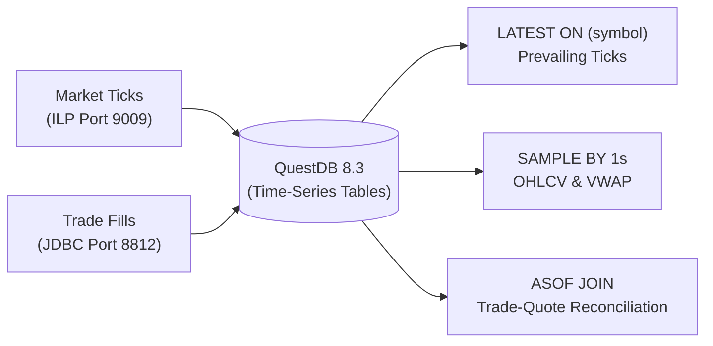

# QuestDB High-Throughput Time-Series Market Tick Engine (`questdb`)

## Overview
The `questdb` module demonstrates **QuestDB**, an ultra-fast, open-source time-series database engineered for financial market data, high-frequency trading (HFT) tick capture, and sub-millisecond quantitative analysis.

This module validates:
1. **InfluxDB Line Protocol (ILP) TCP Streaming**: Ingesting high-velocity market quotes over TCP socket on port `9009`.
2. **`LATEST ON` Operator**: Instantly fetching the latest prevailing quote across all stock tickers (`PARTITION BY symbol`) without scanning historical partitions or computing expensive window functions (`ROW_NUMBER() OVER (...)`).
3. **`SAMPLE BY` Vectorized OHLCV Candlesticks**: Generating 1-second interval candlestick summaries (`first`, `max`, `min`, `last`, and VWAP) in a single vectorized query.
4. **`ASOF JOIN` Execution Reconciliation**: Native out-of-order join reconciling trade executions with the prevailing market bid/ask active immediately at or before execution time.

---

## 🏛️ Technical Capabilities Tested & Validated



### 1. InfluxDB Line Protocol (ILP) Streaming
QuestDB's zero-allocation ILP TCP socket parser allows ingestion speeds exceeding millions of ticks per second:
```
market_quotes,symbol=AMZN bid=195.1000,ask=195.2000,last_price=195.1500,volume=500i 1790327837000000000
```

### 2. Zero-Cost Latest Quote Resolution (`LATEST ON`)
In standard SQL databases, finding the most recent price per ticker requires an expensive scan:
```sql
-- Standard SQL (Slow full-scan window function)
SELECT * FROM (
    SELECT *, ROW_NUMBER() OVER (PARTITION BY symbol ORDER BY timestamp DESC) as rn
    FROM market_quotes
) WHERE rn = 1;
```
In QuestDB, the specialized storage engine maintains index offsets for each symbol, making `LATEST ON` instant:
```sql
SELECT symbol, bid, ask, last_price, volume, timestamp 
FROM market_quotes 
LATEST ON timestamp PARTITION BY symbol 
ORDER BY symbol;
```

### 3. Vectorized Candlestick Aggregation (`SAMPLE BY`)
Aggregates ticks into high-resolution OHLCV buckets directly in SIMD/vectorized assembly:
```sql
SELECT timestamp, 
       first(last_price) as open, 
       max(last_price) as high, 
       min(last_price) as low, 
       last(last_price) as close, 
       sum(volume) as volume, 
       sum(last_price * volume) / sum(volume) as vwap 
FROM market_quotes 
WHERE symbol = 'NVDA' 
SAMPLE BY 1s;
```

### 4. Trade-Quote Alignment (`ASOF JOIN`)
Reconciles trades with the bid/ask spread in effect at the exact moment of execution:
```sql
SELECT t.trade_id, t.symbol, t.price as trade_price, t.quantity as trade_quantity, 
       q.bid as bid_price, q.ask as ask_price, (q.ask - q.bid) as spread, 
       t.timestamp as trade_time, q.timestamp as quote_time 
FROM trade_executions t 
ASOF JOIN market_quotes q ON (symbol) 
WHERE t.symbol = 'TSLA' 
ORDER BY t.timestamp;
```

---

## 🧪 How to Run the Tests

The integration test automatically spins up `questdb/questdb:8.3.2` using Testcontainers:

```bash
mvn test -pl questdb
```
