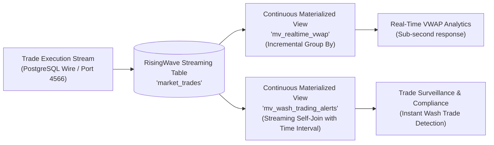

# RisingWave Real-Time Streaming Database (`risingwave`)

## Overview
The `risingwave` module demonstrates **RisingWave**, a distributed SQL streaming database built specifically for real-time stream processing, complex event processing (CEP), and continuous materialized views with sub-second latency. RisingWave is wire-compatible with PostgreSQL, allowing developers to query streaming state using familiar SQL tools and drivers.

This module validates:
1. **Streaming Tables**: Ingestion of real-time market trade events into append-friendly streaming tables.
2. **Continuous Real-Time VWAP**: Materialized views that incrementally update volume-weighted average prices as trades stream in, with zero batch jobs.
3. **Complex Event Processing / Wash Trading Surveillance**: Streaming window joins detecting illicit trading patterns (e.g. wash trading where a single trader buys and sells the same ticker within a 30-second window to fabricate artificial volume).
4. **Deterministic Testing via `FLUSH`**: Immediate checkpointing in unit/integration tests to guarantee consistent reads from materialized views.

---

## 🏛️ Technical Capabilities Tested & Validated



### 1. Continuous Real-Time VWAP
In traditional data architectures, VWAP requires stream-processor state stores (Flink/Kafka Streams) or periodic micro-batches. In RisingWave, it is defined declaratively as a continuous materialized view:
```sql
CREATE MATERIALIZED VIEW mv_realtime_vwap AS
SELECT symbol,
       count(*) as trade_count,
       sum(quantity) as total_volume,
       sum(price * quantity) / sum(quantity) as vwap
FROM market_trades
GROUP BY symbol;
```

### 2. Streaming Wash Trading Surveillance Join
Detects rogue trading activity in real time by joining the incoming trade stream with itself over a sliding time interval:
```sql
CREATE MATERIALIZED VIEW mv_wash_trading_alerts AS
SELECT b.trader_id,
       b.symbol,
       b.trade_id as buy_trade_id,
       s.trade_id as sell_trade_id,
       b.price as buy_price,
       s.price as sell_price,
       b.quantity as volume,
       b.trade_time as buy_time,
       s.trade_time as sell_time
FROM market_trades b
JOIN market_trades s
  ON b.trader_id = s.trader_id
 AND b.symbol = s.symbol
WHERE b.side = 'BUY'
  AND s.side = 'SELL'
  AND s.trade_time >= b.trade_time
  AND s.trade_time <= b.trade_time + INTERVAL '30 SECONDS';
```

---

## 🧪 How to Run the Tests

The integration test automatically spins up `risingwavelabs/risingwave:latest` using Testcontainers:

```bash
mvn test -pl risingwave
```
