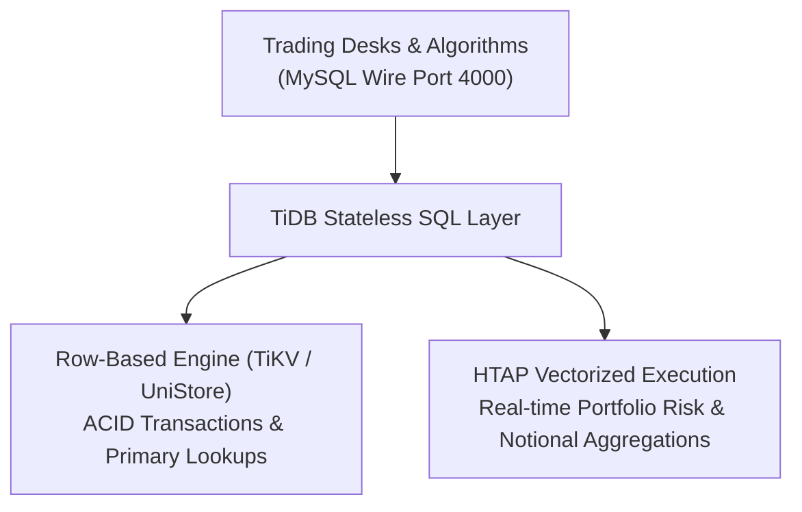

# TiDB Distributed HTAP Database (`tidb`)

## Overview
The `tidb` module demonstrates **TiDB** (by PingCAP), an open-source distributed SQL database designed for Hybrid Transactional and Analytical Processing (HTAP). TiDB decouples compute from storage and offers wire compatibility with MySQL.

In capital markets and trading infrastructure, TiDB excels by allowing the same database to handle:
1. **High-Throughput OLTP**: Low-latency trade order placement, matching updates, and atomic status transitions.
2. **Real-Time HTAP Risk Analytics**: Immediate analytical queries over transactional data (portfolio net exposures, gross notionals, and buy/sell VWAPs) without ETL or separate read replicas.

---

## 🏛️ Technical Capabilities Tested & Validated



### 1. High-Concurrency Transactional Orders
```sql
CREATE TABLE orders (
    order_id VARCHAR(64) NOT NULL PRIMARY KEY,
    account_id VARCHAR(64) NOT NULL,
    symbol VARCHAR(16) NOT NULL,
    side VARCHAR(8) NOT NULL,
    order_type VARCHAR(16) NOT NULL,
    price DECIMAL(18, 4) NOT NULL,
    quantity BIGINT NOT NULL,
    status VARCHAR(16) NOT NULL,
    created_at TIMESTAMP NOT NULL DEFAULT CURRENT_TIMESTAMP,
    KEY idx_account_symbol (account_id, symbol),
    KEY idx_symbol_status (symbol, status)
);
```

### 2. Real-Time Portfolio Risk & Exposure Calculation
Queries active positions and computes net exposure across multiple tickers in real time:
```sql
SELECT account_id,
       symbol,
       SUM(CASE WHEN side = 'BUY' THEN quantity ELSE -quantity END) as net_position,
       SUM(quantity) as gross_volume,
       SUM(price * quantity) as gross_notional,
       SUM(CASE WHEN side = 'BUY' THEN price * quantity ELSE 0 END) / NULLIF(SUM(CASE WHEN side = 'BUY' THEN quantity ELSE 0 END), 0) as vwap_buy,
       SUM(CASE WHEN side = 'SELL' THEN price * quantity ELSE 0 END) / NULLIF(SUM(CASE WHEN side = 'SELL' THEN quantity ELSE 0 END), 0) as vwap_sell
FROM orders
WHERE account_id = 'ACC-RISK-01' AND status = 'FILLED'
GROUP BY account_id, symbol
ORDER BY symbol;
```

---

## 🧪 How to Run the Tests

The integration test automatically spins up `pingcap/tidb:v8.5.0` using Testcontainers:

```bash
mvn test -pl tidb
```
