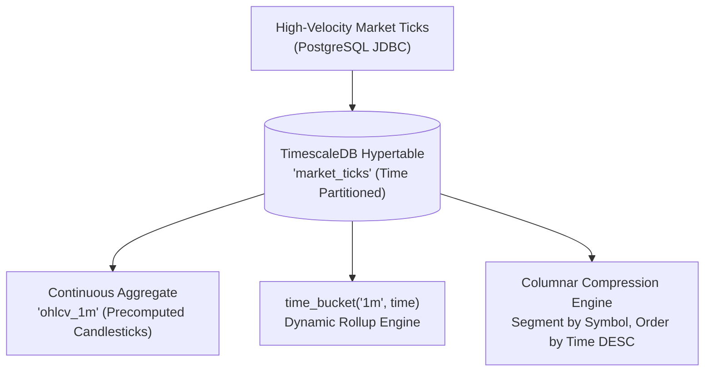

# TimescaleDB Time-Series Engine (`timescaledb`)

## Overview
The `timescaledb` module demonstrates **TimescaleDB**, an open-source time-series database engineered as a PostgreSQL extension. It combines the reliability and rich ecosystem of PostgreSQL (full SQL, secondary indexes, foreign keys, and ACID compliance) with hypertable automatic chunk partitioning, continuous aggregates, dynamic time-bucket aggregation, and native columnar compression.

This module validates:
1. **Hypertables**: Transparent time-based table partitioning into chunks under PostgreSQL.
2. **`time_bucket` Dynamic Aggregations**: Dynamic grouping of tick timestamps into custom intervals (e.g., 1-second, 1-minute, 5-minute) with `first()`, `last()`, `min()`, `max()`, and volume rollups.
3. **Continuous Aggregates**: Real-time materialized views (`ohlcv_1m`) that incrementally maintain precomputed candlestick data as new ticks arrive.
4. **Columnar Compression**: TimescaleDB chunk-level columnar compression (`compress_segmentby = 'symbol'`, `compress_orderby = 'time DESC'`) to slash storage footprints by up to 90%.

---

## 🏛️ Technical Capabilities Tested & Validated



### 1. Hypertables
Hypertables look like standard PostgreSQL tables to the client, but are partitioned under the hood into sub-tables (chunks) based on timestamp intervals:
```sql
CREATE TABLE market_ticks (
    time TIMESTAMPTZ NOT NULL,
    symbol TEXT NOT NULL,
    price DOUBLE PRECISION NOT NULL,
    volume BIGINT NOT NULL
);

SELECT create_hypertable('market_ticks', 'time', if_not_exists => TRUE);
```

### 2. Dynamic Time-Bucket Candlesticks (`time_bucket`)
Generates arbitrary timeframe OHLCV bars using TimescaleDB's `time_bucket()`, `first()`, and `last()` aggregate functions:
```sql
SELECT time_bucket(INTERVAL '1 minute', time) AS bucket,
       symbol,
       first(price, time) as open,
       max(price) as high,
       min(price) as low,
       last(price, time) as close,
       sum(volume) as volume
FROM market_ticks
WHERE symbol = 'AAPL'
GROUP BY bucket, symbol
ORDER BY bucket;
```

### 3. Continuous Aggregates
Continuous aggregates continuously refresh materialized views in the background or on demand via `refresh_continuous_aggregate`:
```sql
CREATE MATERIALIZED VIEW ohlcv_1m
WITH (timescaledb.continuous) AS
SELECT time_bucket('1 minute', time) AS bucket,
       symbol,
       first(price, time) as open,
       max(price) as high,
       min(price) as low,
       last(price, time) as close,
       sum(volume) as volume
FROM market_ticks
GROUP BY bucket, symbol
WITH NO DATA;

CALL refresh_continuous_aggregate('ohlcv_1m', NULL, NULL);
```

### 4. Native Columnar Compression
Converts row-based chunks into compressed columnar format, segmented by ticker symbol:
```sql
ALTER TABLE market_ticks SET (
    timescaledb.compress,
    timescaledb.compress_segmentby = 'symbol',
    timescaledb.compress_orderby = 'time DESC'
);

SELECT compress_chunk(c.chunk_schema || '.' || c.chunk_name) 
FROM timescaledb_information.chunks c 
WHERE c.hypertable_name = 'market_ticks';

SELECT * FROM hypertable_compression_stats('market_ticks');
```

---

## 🧪 How to Run the Tests

The integration test automatically spins up `timescale/timescaledb:latest-pg16` using Testcontainers:

```bash
mvn test -pl timescaledb
```
