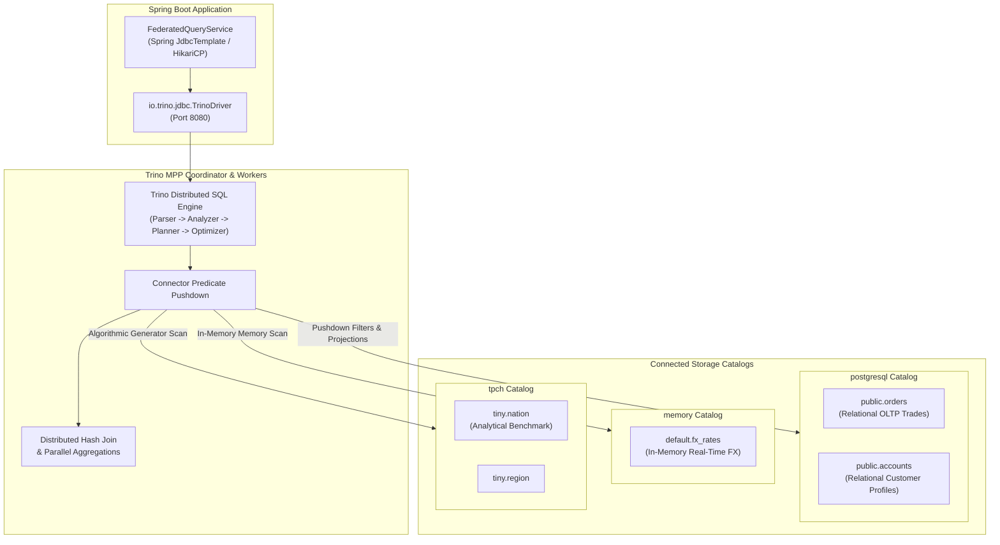

# Trino Query Federation Module (`trino-federation`)

[](https://openjdk.org/projects/jdk/25/)
[](https://spring.io/projects/spring-boot)
[](https://trino.io/)
[](https://testcontainers.com/)

Production-grade reference implementation and verification suite for **Distributed Heterogeneous SQL Query Federation** using **Trino** (formerly PrestoSQL), **PostgreSQL**, **In-Memory Catalogs**, and **Spring Boot 4.1.1** with **Java 25**.

---

## 💡 The Distributed Data Silo Challenge

In modern enterprise and capital markets architectures, data is fragmented across specialized storage engines:
* **Relational OLTP (e.g. PostgreSQL, CockroachDB)**: Transactional accounts, trade executions, order audits.
* **In-Memory / Fast Data (e.g. Memory Catalog, Redis)**: Real-time FX exchange rates, dynamic risk multipliers, volatile market quotes.
* **Lakehouses & Object Stores (e.g. Iceberg, Delta Lake, S3)**: Historical tick archives, partition-pruned historical metrics.

Traditional approaches require costly, brittle ETL pipelines to copy all data into a single monolithic data warehouse before analysis can begin. 

**Trino** solves this by separating compute from storage. It executes massively parallel processing (MPP) ANSI SQL queries across heterogeneous connectors **in-place without data movement**, delegating predicate filters down to the source systems and performing distributed hash joins in memory.

---

## 🏛️ Architecture & Federation Topology



---

## ⚡ Key Scenarios Tested & Validated

All scenarios are verified against live **Trino** (`trinodb/trino:435`) and **PostgreSQL** (`pgvector/pgvector:pg17`) containers sharing an isolated Docker network:

### 1. Multi-Engine Catalog Auto-Discovery
* Validates that the Trino coordinator discovers and registers all mounted catalogs:
  * `postgresql`: Mounts `/etc/trino/catalog/postgresql.properties` pointing to the PostgreSQL container.
  * `memory`: High-throughput in-memory table store.
  * `tpch`: Trino standard TPC-H analytical benchmark dataset generator.
  * `system`: Trino runtime telemetry, query diagnostics, and node metadata.

### 2. Cross-Catalog 3-Way Distributed JOIN
Executes a single unified ANSI SQL query joining transactional PostgreSQL relational tables with Trino In-Memory currency rates:

```sql
SELECT 
    o.order_id,
    o.account_number,
    a.account_name,
    a.tier,
    o.ticker,
    o.side,
    CAST(o.price AS DECIMAL(18, 4)) AS price,
    CAST(o.quantity AS DECIMAL(18, 4)) AS quantity,
    o.currency,
    fx.fx_rate,
    CAST(o.price * o.quantity * fx.fx_rate AS DECIMAL(18, 4)) AS notional_usd
FROM postgresql.public.orders o
JOIN postgresql.public.accounts a ON o.account_number = a.account_number
JOIN memory.default.fx_rates fx ON o.currency = fx.currency
ORDER BY notional_usd DESC
```

* **Validated Result**: Joins multi-currency orders across USD, EUR, and GBP, applying real-time FX conversions (e.g. ASML in EUR: €750.00 × 200 × 1.085 = $162,750 USD; AZN in GBP: £65.00 × 3,000 × 1.295 = $252,525 USD).

### 3. Distributed Risk Aggregation & Predicate Pushdown
Aggregates risk exposure by ticker for specific customer tiers (`WHERE a.tier = 'PLATINUM'`).
* Trino delegates the tier filter directly to PostgreSQL (`ScanFilter[dynamicFilters = ...]`), preventing unneeded row transfer over the network.
* Trino calculates `SUM(quantity)`, `SUM(notional_usd)`, and `AVG(price)` across workers.
* Verifies non-qualifying accounts (`GOLD`, `BRONZE`) are excluded.

### 4. Analytical TPC-H Benchmark Federation
Queries Trino's built-in TPC-H data generator (`tpch.tiny.nation` joined with `tpch.tiny.region`) to demonstrate cross-domain benchmark capabilities.

### 5. Physical Query Plan Inspection (`EXPLAIN`)
Executes `EXPLAIN` on federated queries to confirm:
* `ScanFilter` pushdowns on the PostgreSQL connector.
* Partitioned and replicated `InnerJoin` distributions.
* Memory scan fragments.

---

## 🛠️ Configuration & Catalog Setup

To attach a PostgreSQL database to Trino, mount a properties file into `/etc/trino/catalog/postgresql.properties`:

```properties
connector.name=postgresql
connection-url=jdbc:postgresql://postgres:5432/testdb
connection-user=test
connection-password=test
```

Spring Boot connects via the official `io.trino.jdbc.TrinoDriver`:

```yaml
spring:
  datasource:
    url: jdbc:trino://localhost:8080/memory/default
    driver-class-name: io.trino.jdbc.TrinoDriver
    username: test
```

---

## 🧪 Running the Tests

Ensure Docker is running, then execute:

```bash
mvn test -pl trino-federation
```
