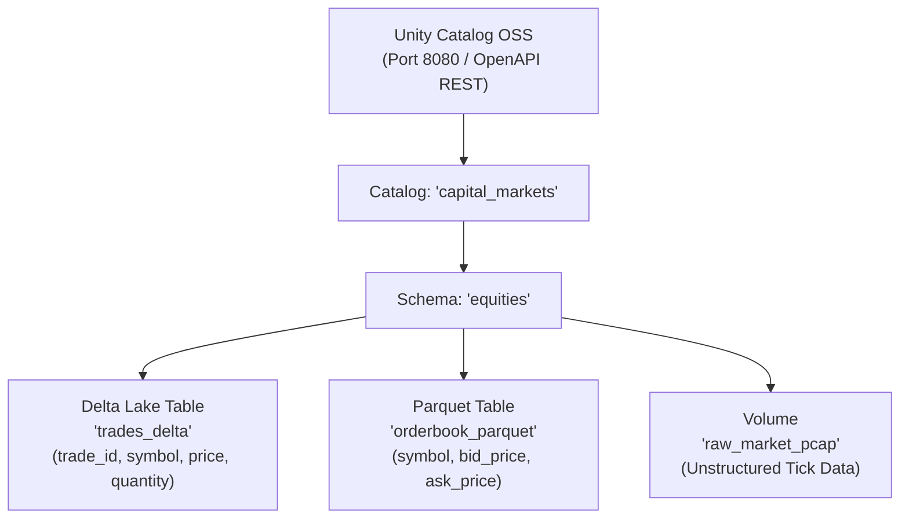

# Unity Catalog Open Source (`unitycatalog-oss`)

## Overview
The `unitycatalog-oss` module demonstrates **Unity Catalog Open Source** (by Databricks and the Linux Foundation), the industry's open, universal catalog for data and AI governance. It provides a centralized, multi-engine metadata and access control layer across open table formats (Delta Lake, Apache Iceberg, Apache Parquet) and unstructured asset volumes.

This module validates:
1. **Three-Level Namespace**: Organizing assets via `catalog.schema.table` hierarchy (`capital_markets.equities.trades_delta`).
2. **Multi-Format Table Governance**: Uniform registration of Delta Lake and Apache Parquet tables with typed column schemas, positions, and nullability.
3. **Volumes for Unstructured Financial Data**: Provisioning managed/external volumes for raw market PCAPs, fix logs, and model artifacts.
4. **OpenAPI Specification**: Interacting with Unity Catalog's REST endpoints (`/api/2.1/unity-catalog/*`) using Spring Boot's modern `RestClient`.

---

## 🏛️ Technical Capabilities Tested & Validated



### 1. Three-Level Namespace & Multi-Format Cataloging
Unity Catalog standardizes governance across storage formats without cloud vendor lock-in:
```json
POST /api/2.1/unity-catalog/tables
{
  "name": "trades_delta",
  "catalog_name": "capital_markets",
  "schema_name": "equities",
  "table_type": "EXTERNAL",
  "data_source_format": "DELTA",
  "storage_location": "file:///tmp/uc/capital_markets/equities/trades_delta",
  "columns": [
    {"name": "trade_id", "type_text": "string", "type_name": "STRING", "position": 0, "nullable": false},
    {"name": "symbol", "type_text": "string", "type_name": "STRING", "position": 1, "nullable": false},
    {"name": "price", "type_text": "double", "type_name": "DOUBLE", "position": 2, "nullable": false},
    {"name": "quantity", "type_text": "long", "type_name": "LONG", "position": 3, "nullable": false}
  ]
}
```

### 2. Volumes Governance
Provides governance for unstructured files (raw tick captures, FIX logs):
```json
POST /api/2.1/unity-catalog/volumes
{
  "name": "raw_market_pcap",
  "catalog_name": "capital_markets",
  "schema_name": "equities",
  "volume_type": "EXTERNAL",
  "storage_location": "file:///tmp/uc/capital_markets/equities/volumes/raw_market_pcap"
}
```

---

## 🧪 How to Run the Tests

The integration test automatically spins up `unitycatalog/unitycatalog:latest` using Testcontainers:

```bash
mvn test -pl unitycatalog-oss
```
